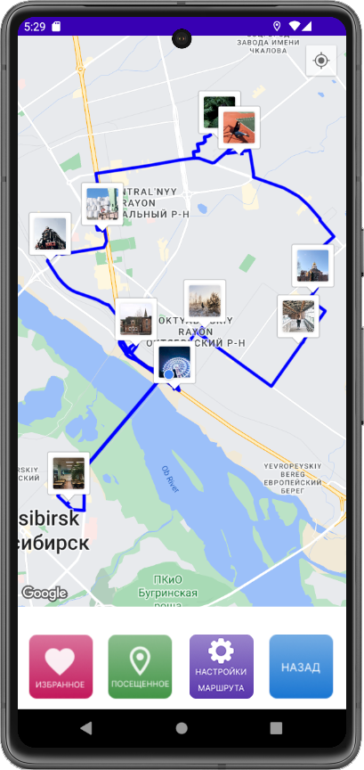
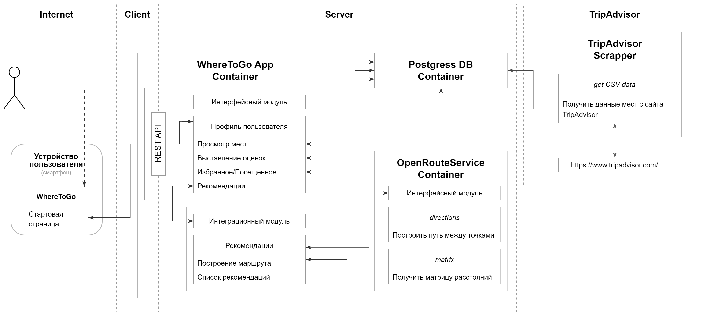
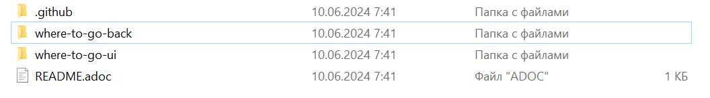

= WhereToGo.NSK

== Рекомендательная система мест для посещения в Новосибирске

Проект разрабатывался в рамках выполнения выпускной квалификационной работы в бакалавре. Сейчас продолжается работа над проектом уже в рамках магистерской работы.

== Концептуальная архитектура

Приложение имеет клиент-серверную архитектуру:

* Android-приложение клиента
* Spring-сервер с базой данных PostgreSQL

== Структура файлов проекта

Структура делится на 2 основных модуля - для клиентской и серверной части.

Для компиляции и запуска обеих частей приложения необходимо использовать следующие ПО:

 * Intellij IDEA CE - серверная часть (открывать директорию *_where-to-go-back/_*)
 * Android Studio - клиентская часть (открывать директорию *_where-to-go-ui/_*)

Подробные инструкции по настройке и запуску обеих частей описаны в разделах *WhereToGo.NSK Backend* и *WhereToGo.NSK Android*.